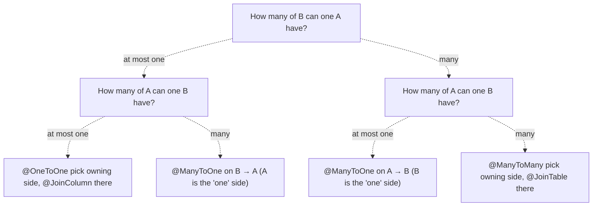

# JPA / Hibernate Entity Relationship Mapping — Cheat Sheet

**The one idea that makes everything else make sense**

A relationship annotation describes two separate things at once, and conflating them is where most confusion comes from:

1. **The database reality** — where does the foreign key (or join table) actually live?
2. **The Java convenience** — which entity classes have a field pointing at the other?

The database reality is fixed by the cardinality of the relationship (one-to-one, one-to-many, many-to-many). The Java
convenience — whether you can navigate from both sides in code — is a design choice you make on top of it.

**Owning side** = the entity whose mapping controls the actual foreign key / join table in the database. Hibernate
reads/writes the FK based on what happens to the owning side's field.

**Inverse (non-owning) side** = the side that just mirrors the relationship for convenience. It's marked with mappedBy,
and
Hibernate ignores it for the purposes of deciding what SQL to write — it exists purely so you can call
`author.getBooks()` instead of writing a query.

---

**The four relationship types at a glance**

| Relationship  | Who owns it?                                      | Where's the FK/table                   | Default fetch |
|---------------|---------------------------------------------------|----------------------------------------|---------------|
| `@ManyToOne`  | The side with `@ManyToOne` (always)               | FK column on this entity's table       | `EAGER`       |
| `@OneToMany`  | Never — it's the mirror of `@ManyToOne`           | N/A (lives on the "many" side's table) | `LAZY`        |
| `@OneToOne`   | Whichever side you choose to put `@JoinColumn` on | FK column on the owning side's table   | `EAGER`       |
| `@ManyToMany` | Whichever side you choose to put `@JoinTable` on  | Separate join table (always)           | `LAZY`        |

Two things worth noticing immediately:

- `@ManyToOne` and `@OneToMany` are **not two independent decisions** — they're the same real-world relationship
  described from two ends. Whenever you write one, you're implicitly deciding the other exists too.
- `@OneToOne` and `@ManyToMany` are the two cases where you get to pick the owning side, because the cardinality alone
  doesn't force it.

---

**Rule 1 — Finding the owning side**

For `@OneToMany` / `@ManyToOne` pairs: the "many" side is always the owner. This is not a convention, it's a structural
fact — a "one" row can't hold a single FK column pointing at multiple "many" rows, so the FK has to sit on the "many"
table. That's why `mappedBy` always sits on the `@OneToMany` (the "one") side, pointing at the field name declared on
the `@ManyToOne` (the "many") side.

```java
// Owning side — holds the actual FK column (author_id) in the "book" table
@Entity
class Book {
    @ManyToOne
    @JoinColumn(name = "author_id")
    private Author author;
}

// Inverse side — no FK here, just a convenience view
@Entity
class Author {
    @OneToMany(mappedBy = "author")   // "author" = the field name in Book
    private List<Book> books = new ArrayList<>();
}
```

For `@OneToOne`: you choose. Put `@JoinColumn` on whichever entity is more naturally "dependent" — e.g. a `UserProfile`
depending on `User` — and put `mappedBy` on the other side.

For `@ManyToMany`: you choose. Put `@JoinTable` on whichever side reads more naturally as the "primary" entity, and
`mappedBy` on the other. The choice has zero effect on the database schema — it only affects which entity's mapping
Hibernate consults when writing to the join table.

---

**Rule 2 — Join column vs. join table**

| Situation                                            | What you get                                                                                                                      |
|------------------------------------------------------|-----------------------------------------------------------------------------------------------------------------------------------|
| `@ManyToOne` / `@OneToOne`                           | A plain FK column (`@JoinColumn`) on the owning table                                                                             |
| `@ManyToMany`                                        | Always a separate join table with two FK columns — no other option, because both sides can have many matches on the other         |
| `@OneToMany` **without** `mappedBy` (unidirectional) | ⚠️ Hibernate defaults to creating *an extra join table* instead of a FK column on the child — almost always **not** what you want |

That last row is a classic gotcha. If you write a unidirectional `@OneToMany` (no matching `@ManyToOne` on the other
side) and don't add `@JoinColumn` yourself, Hibernate silently creates a hidden join table to represent the
relationship, because it has no `@ManyToOne` field to attach a `mappedBy` to. Fix it explicitly:

```java

@Entity
class Author {
    @OneToMany
    @JoinColumn(name = "author_id")   // forces FK onto Book's table, no join table
    private List<Book> books = new ArrayList<>();
}
```

This works, but it means **Book** has no idea it belongs to an `Author` in code — Hibernate manages the FK from the
"one" side, which is a bit unusual. Most of the time it's cleaner to just make it bidirectional (or fully unidirectional
the other way, with `@ManyToOne` on `Book`) instead of using this pattern.

---

**Rule 3 — Unidirectional or bidirectional by default?**

**Default to unidirectional**. Add the reverse navigation only when you have an actual, concrete need to walk the graph
that
direction in code — not "it might be handy." Every bidirectional relationship costs you:

- Extra discipline to keep both sides in sync (see helper methods below) — forget it and you get subtle bugs where
  Hibernate doesn't see the change.
- `equals()/hashCode()/toString()` hazards — Lombok's `@Data` on entities with bidirectional relationships is a common
  cause of `StackOverflowError` from infinite recursion (`Author.toString() → Book.toString() → Author.toString() → …`).
- A steeper learning curve for anyone reading the code — they now have to check both entities to understand one
  relationship.

Rules of thumb per relationship type:

- `@ManyToOne` **alone** (**no** `@OneToMany` **back-reference**): very common and usually correct. `Order → Customer`
  doesn't need  `Customer → List<Order>` unless you actually call c`ustomer.getOrders()` somewhere — a repository method
  `orderRepository.findByCustomerId(id)` is often simpler and lets you control paging/sorting/filtering, which a lazy
  collection doesn't.
- `@OneToOne`: default unidirectional (FK on the dependent entity, e.g. `UserProfile → User`). Add the inverse only if
  you need `user.getProfile()`.
- `@ManyToMany`: bidirectional is more common here because both entities are usually peers of equal standing (`Student ↔
  Course`), and it's natural to want `student.getCourses()` and `course.getStudents()` both. Still ask whether you
  really need both directions before adding them.

---

**Decision flowchart**



---

**Worked examples**

`@OneToOne` — **bidirectional**, `User` / `UserProfile`

```java

@Entity
class User {
    @Id
    @GeneratedValue
    private Long id;

    @OneToOne(mappedBy = "user", cascade = CascadeType.ALL, orphanRemoval = true)
    private UserProfile profile;
}

@Entity
class UserProfile {
    @Id
    @GeneratedValue
    private Long id;

    @OneToOne
    @JoinColumn(name = "user_id")   // owning side — FK lives in user_profile table
    private User user;
}
```

`@OneToMany` / `@ManyToOne` — **bidirectional**, `Author` / `Book`

```java

@Entity
class Author {
    @Id
    @GeneratedValue
    private Long id;

    @OneToMany(mappedBy = "author", cascade = CascadeType.ALL, orphanRemoval = true)
    private List<Book> books = new ArrayList<>();

    // Helper methods keep both sides in sync — always write these for bidirectional relations
    public void addBook(Book book) {
        books.add(book);
        book.setAuthor(this);
    }

    public void removeBook(Book book) {
        books.remove(book);
        book.setAuthor(null);
    }
}

@Entity
class Book {
    @Id
    @GeneratedValue
    private Long id;

    @ManyToOne(fetch = FetchType.LAZY)   // override the EAGER default — almost always want LAZY
    @JoinColumn(name = "author_id")
    private Author author;
}
```

`@ManyToMany` — **bidirectional**, `Student` / `Course`

```java

@Entity
class Student {
    @Id
    @GeneratedValue
    private Long id;

    @ManyToMany
    @JoinTable(
            name = "student_course",
            joinColumns = @JoinColumn(name = "student_id"),
            inverseJoinColumns = @JoinColumn(name = "course_id")
    )
    private Set<Course> courses = new HashSet<>();   // owning side
}

@Entity
class Course {
    @Id
    @GeneratedValue
    private Long id;

    @ManyToMany(mappedBy = "courses")
    private Set<Student> students = new HashSet<>();   // inverse side
}
```

Note `Set` instead of `List` for the `@ManyToMany` collections — this is the usual recommendation, since Hibernate can
end up
issuing surprising extra SQL to maintain list ordering/indices on many-to-many collections, and duplicates aren't
meaningful for these relationships anyway.

---

**Common pitfalls (roughly in order of "how often this bites people")**

1. `FetchType.EAGER` **left on by default**. `@ManyToOne` and `@OneToOne` default to `EAGER`. On any nontrivial entity
   graph this
   causes accidental full-table loads. Explicitly set `fetch = FetchType.LAZY` on almost everything and opt into eager
   loading per-query with `JOIN FETCH` (JPQL) or `@EntityGraph` (Spring Data) when you actually need it.
2. **Forgetting the sync helper methods on bidirectional relations**. If you only do `book.setAuthor(author)` without
   also
   adding `book` to `author.getBooks()`, the in-memory object graph is now inconsistent — even though the database write
   is
   fine, because the owning side (`Book`) is the one Hibernate actually listens to.
3. `@Data` **(Lombok) on entities with bidirectional relationships**, causing infinite recursion in generated `toString()
   /equals()/hashCode()`. Use `@ToString.Exclude` / `@EqualsAndHashCode.Exclude` on the relationship fields, or write
   `equals/hashCode` by hand based on a business key (not the whole object graph, and generally not the
   `@GeneratedValue` id
   before it's persisted).
4. **Unidirectional** `@OneToMany` **without** `@JoinColumn`, silently creating an extra join table you didn't ask for
   (see Rule 2
   above).
5. `CascadeType.ALL` **used carelessly**, especially with `orphanRemoval = true` on a relationship where deleting the
   parent
   shouldn't delete the child (e.g. don't cascade-delete `Author` and expect `Books` to vanish if books can legitimately
   outlive their author record).
6. **The N+1 select problem** — looping over a lazily-loaded collection (`for (Book b : author.getBooks())`) issues one
   query
   per author. Fix with `JOIN FETCH` in a JPQL query or a Spring Data `@EntityGraph`, not by flipping everything to
   `EAGER`.

---

**Quick reference recap**

| Question                                               | Answer                                                                                           |
|--------------------------------------------------------|--------------------------------------------------------------------------------------------------|
| Does @ManyToMany always need a join table?             | Yes, always — no alternative.                                                                    |
| Is mappedBy always on the "one" side of a one-to-many? | Yes, always — structurally forced.                                                               |
| Is @JoinColumn always on the "many" side?              | Yes, always — that's where the FK physically lives.                                              |
| Who owns a @OneToOne?                                  | Whoever you put @JoinColumn on — your choice.                                                    |
| Who owns a @ManyToMany?                                | Whoever you put @JoinTable on — your choice.                                                     |
| Default fetch for @ManyToOne/@OneToOne?                | EAGER — override to LAZY almost always.                                                          |
| Default fetch for @OneToMany/@ManyToMany?              | LAZY — usually leave as-is.                                                                      |
| Bidirectional by default?                              | No — unidirectional by default, add the reverse only when you need to navigate that way in code. |
